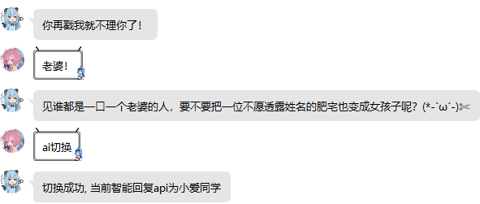
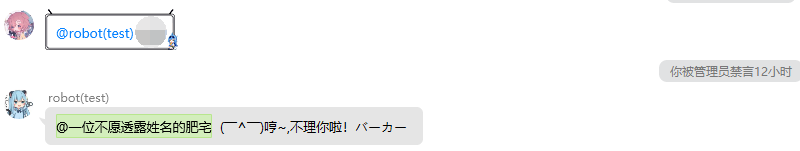
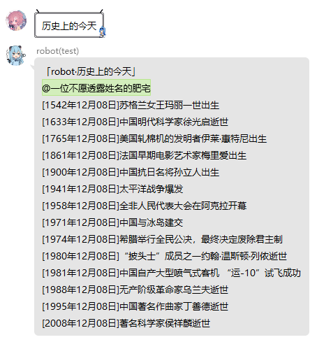
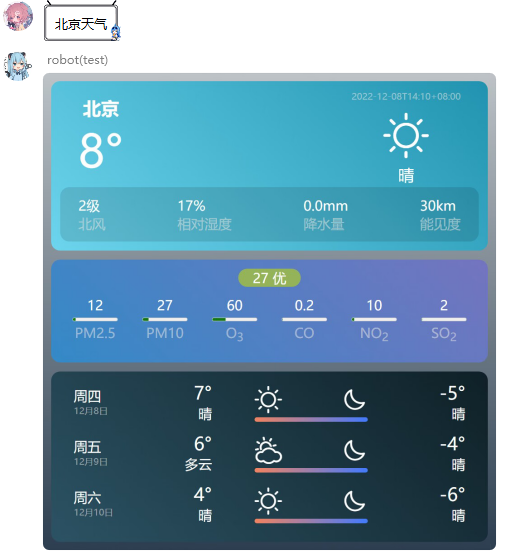
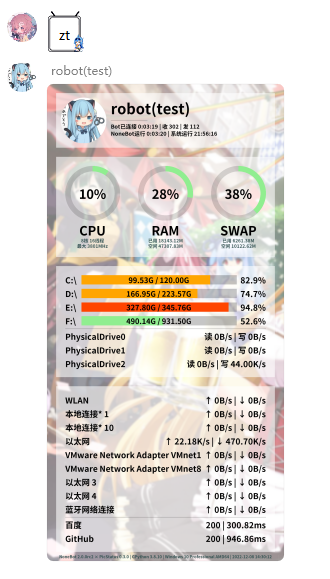

## 智能(障)回复插件

### 搬运自[nonebot2商店插件](https://github.com/Special-Week/nonebot_plugin_smart_reply)

智能回复,包括戳一戳

#### 用法

|    功能    |                用法                 |   权限    | 需要@ | 是否阻断 | 优先级  |
| :--------: | :---------------------------------: | :-------: | :---: | :------: | ------- |
|   ai切换   | ai切换, api_switch, 智能回复api切换 | SUPERUSER |  是   |   True   | default |
|  智能回复  |            @bot发送信息             |    any    |  是   |  False   | 99      |
| 戳一戳回复 |              戳一戳bot              |    any    |  是   |  False   | default |

#### env配置项:

| config        | type   | default | example                            | usage                          |
| ------------- | ------ | ------- | ---------------------------------- | ------------------------------ |
| xiaoai_apikey | string | 寄      | xiaoai_apikey = "abc1145141919810" | 小爱同学的apiKey, 详细请看下文 |
| Bot_NICKNAME  | string | 咱      | Bot_NICKNAME = "Hinata"            | 你Bot的称呼                    |
| Bot_MASTER    | string | 主人    | Bot_MASTER = "星野日向_Official"   | 你Bot主人的称呼                |

#### 其他

小爱同学apiKey的申请步骤:

```
1. 进入网页 https://apibug.cn/doc/xiaoai.html
2. 右上角注册登录
3. 左边接口列表
4. 找到"小爱同学AI"零元购买
5. 请求接口中 "&apiKey="后面的值就是你的apiKey, 填在.env内, 假设返回你的请求接口是 "https://apibug.cn/api/xiaoai/?msg=你是谁？&apiKey=abc1145141919810" 
   那么你应该在.env内填入:  xiaoai_apikey = "abc1145141919810"
```

- 艾特bot时回复一些基于词库, 或青云客api或者小爱同学拿到的消息(优先词库, 这个词库有点色情)
- 去除了原项目的戳一戳50%概率回复莲宝的藏话 ,100%回复poke__reply ，对戳一戳回复内容稍作调整
- 智障回复的优先级是99, 并且block = False, 也就是说基本上不用担心这个智障回复阻断其他消息
- 但由于优先级较低(数字越大越低), 可能被其他插件阻断




## 今日运势

### 搬运自[nonebot2商店插件](https://github.com/MinatoAquaCrews/nonebot_plugin_fortune)


## 反嘴臭

### 搬运自[nonebot2商店插件](https://github.com/tkgs0/nonebot-plugin-antiinsult)

**本插件为被动插件**

检测到有用户 `@机器人` 并嘴臭时将其临时屏蔽(bot重启后失效)
当bot为群管理时会请对方喝昏睡红茶(禁言)

#### 用法

|      功能       |             用法             |   权限    | 需要@ | 是否阻断 | 优先级 |
| :-------------: | :--------------------------: | :-------: | :---: | :------: | ------ |
|     反嘴臭      |         对机器人嘴臭         |    any    |  是   |  False   | 98     |
| 查看临时黑名单  |        查看临时黑名单        | SUPERUSER |  是   |   True   | 1      |
|    解除屏蔽     |     解除屏蔽 qq1,qq2...      | SUPERUSER |  是   |   True   | 1      |
|    对线模式     | 启用/禁用+飞马令/飞🐴令/飞🐎令 | SUPERUSER |  是   |   True   | 1      |
| 添加/删除屏蔽词 |       添加/删除屏蔽词        | SUPERUSER |  是   |   True   | 1      |

#### env配置项:

无

#### 其他

- 超级用户不受临时屏蔽影响 *但是会被昏睡红茶影响*

- 当bot的群权限比超级用户高的时候, 超级用户也有机会品尝昏睡红茶

- 被bot灌了昏睡红茶的用户不会进临时黑名单

- `解除屏蔽` 可以解除临时屏蔽, 也可以解除禁言(当然, 需要bot为群管理).

- 你说从聊天界面查看屏蔽词库? 噢, 我亲爱的老伙计, 你怕是疯了!

- 飞马令为对线模式,不建议开启

	


## 历史上的今天

### 搬运自[nonebot2商店插件](https://github.com/AquamarineCyan/nonebot-plugin-today-in-history)

图片形式显示服务器运行状态与资源占用

#### 用法

|     功能     |     用法     | 权限 | 需要@ | 是否阻断 | 优先级 |
| :----------: | :----------: | :--: | :---: | :------: | ------ |
| 历史上的今天 | 历史上的今天 | any  |  否   |   True   | 7      |

#### env配置项:

|       config        |   type    | default | example                     | usage                      |
| :-----------------: | :-------: | :-----: | :-------------------------- | -------------------------- |
| history_qq_friends  | list[int] |   无    | history_qq_friends=[qq1...] | 设定要发送的QQ好友         |
|  history_qq_groups  | list[int] |   无    | history_qq_groups=[qq1...]  | 设定要发送的群             |
| history_inform_time |  string   |   无    | history_inform_time="7 35"  | 设定每天发送时间，空格间隔 |

#### 其他

- 发送 `历史上的今天`

  > 完全匹配 `历史上的今天`

- 定时任务，`.env`配置发送好友、群、时间

- 定时任务好像有问题无法触发，原因不明

	


## 鲁迅说

### 搬运自[TakkerBot](https://github.com/FYWinds/takker)

生成鲁迅说过弔图

#### 用法

|      功能       |        用法         | 权限 | 需要@ | 是否阻断 | 优先级 |
| :-------------: | :-----------------: | :--: | :---: | :------: | ------ |
| 生成鲁迅说过... | 鲁迅说过+你要说的话 | any  |  否   |   True   | 20     |

#### env配置项:

无

#### 其他


## 和风天气

### 搬运自[nonebot2商店插件](https://github.com/kexue-z/nonebot-plugin-heweather)

#### 用法

|   功能   |            用法            | 权限 | 需要@ | 是否阻断 | 优先级 |
| :------: | :------------------------: | :--: | :---: | :------: | ------ |
| 天气查询 | `天气+地区` 或 `地区+天气` | any  |  否   |   True   | 1      |

#### env配置项:

| config           | type   | default | example               | usage                                                        |
| ---------------- | ------ | ------- | --------------------- | ------------------------------------------------------------ |
| QWEATHER_APIKEY  | string | 无      | QWEATHER_APIKEY=xxxxx | 和风天气的apiKey, 详细请看下文                               |
| QWEATHER_APITYPE | int    | 无      | QWEATHER_APITYPE = 0  | 0 = 普通版(3天天气预报) 1 = 个人开发版(7天天气预报) 2 = 商业版 (7天天气预报) |

#### 其他

APIKEY获取方式

```
1、注册和风天气账号
进入官网注册https://id.qweather.com/#/login
2、进入控制台
登录后，点击 “和风天气开发者控制台”
3、创建项目
点击控制台左侧 “项目管理”，然后点击 “创建项目”，根据提示自行填写
“选择订阅” -> “免费订阅”，“设置KEY” -> “Web API”，都填好后“创建”
4、获取key并配置.env.xx
返回 “项目管理”，可以看到创建的项目，点击KEY下面的 “查看”，复制KEY到你的.env.xx即可。
```




## picStatus

### 搬运自[nonebot2商店插件](https://github.com/lgc2333/nonebot-plugin-picstatus)

图片形式显示服务器运行状态与资源占用

#### 用法

|      功能      |           用法            |   权限    | 需要@ | 是否阻断 | 优先级 |
| :------------: | :-----------------------: | :-------: | :---: | :------: | ------ |
| 服务器状态查询 | 状态 / zt / yxzt / status | SUPERUSER |  否   |   True   | 1      |

#### env配置项:

见[.env.example](https://github.com/lgc2333/nonebot-plugin-picstatus/blob/master/.env.example) 

#### 其他

- 可以在消息后面跟一张图片或者回复一张图片来自定义背景图，默认为随机背景图 更多自定义项参见 [配置](https://github.com/lgc2333/nonebot-plugin-picstatus#%EF%B8%8F-%E9%85%8D%E7%BD%AE) 

- 最底部与Google的通信情况改为gayhub

	


